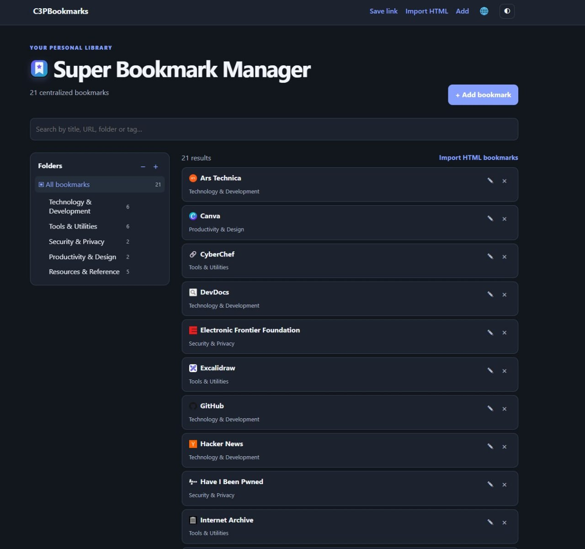
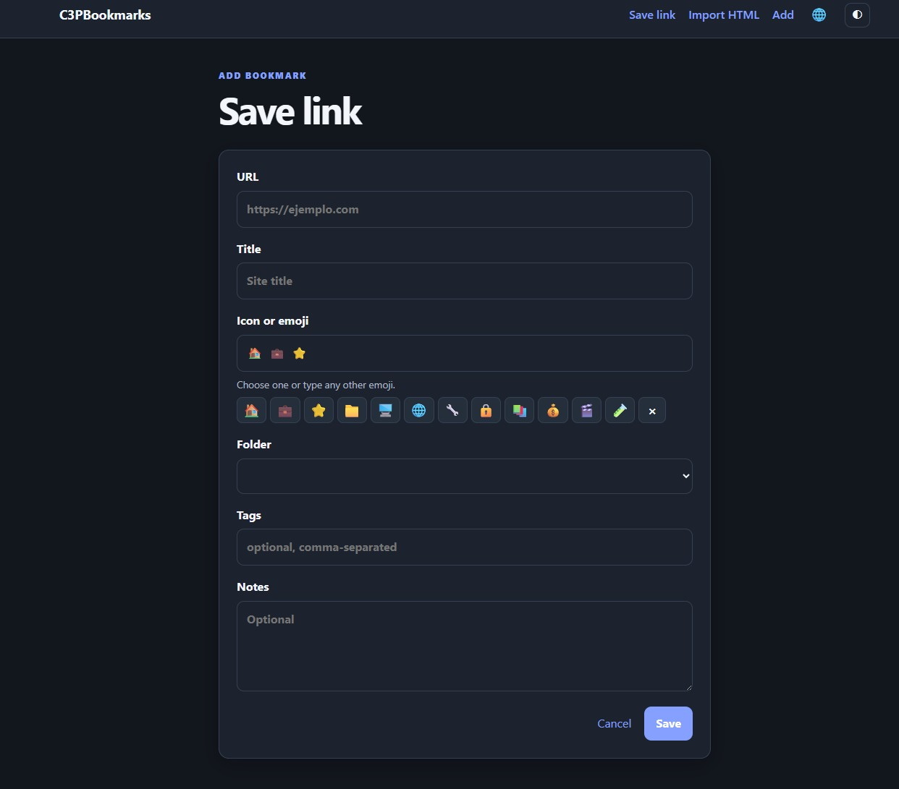
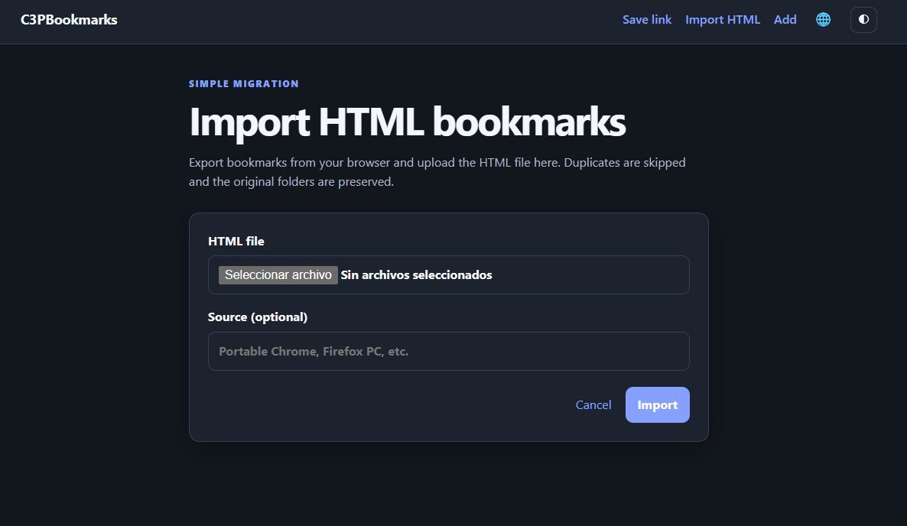
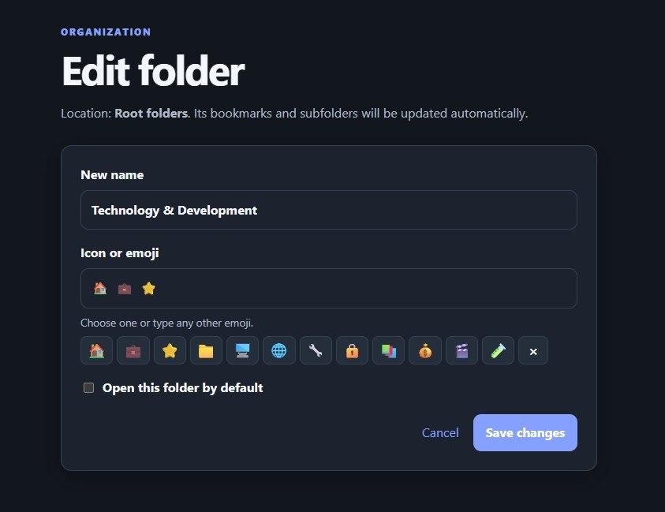
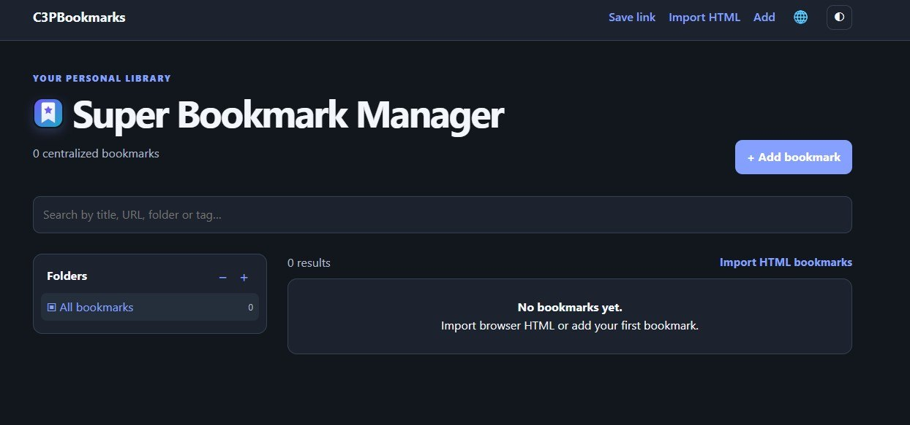

# C3PBookmarks

A simple, web-first, self-hosted bookmark manager. Save links, organize them
into folders and subfolders, search your library, import browser bookmarks,
and use a bookmarklet to save the current page.

C3PBookmarks is free and open source. You can use, modify, and self-host it at
no cost.

The distributed application is intentionally empty: it contains no bookmarks,
database, credentials, or configuration from any specific installation.

## Screenshots

### Your bookmark library



### Save a bookmark



### Import browser bookmarks



### Organize folders



The application also starts cleanly with an empty library:



## Features

- Responsive interface with light and dark modes.
- Manual bookmark creation and editing, including tags, notes, and icons.
- Import from HTML exported by Chrome, Firefox, and other browsers.
- Global search powered by SQLite FTS5.
- Folders and subfolders with renaming, icons, a default folder, and manual ordering.
- Drag and drop to move and reorder folders and bookmarks.
- Language selector with English, Spanish, Italian, Portuguese, and German.
- Bookmarklet for saving links from any page without installing an extension.
- Local SQLite persistence and simple Docker Compose deployment.

## Quick start with Docker Compose

Requirements: Docker Engine and Docker Compose v2.

Clone the repository and enter its directory:

```bash
git clone https://github.com/joafer/c3pbookmarks.git
cd c3pbookmarks
```

Start the application:

```bash
docker compose up -d --build
```

Open <http://localhost:8000>. The application automatically creates an empty
SQLite database in `data/` on first start.

To use a different host port, copy the example configuration and edit it:

```bash
cp .env.example .env
# Edit C3PBOOKMARKS_HOST_PORT, for example 8080
docker compose up -d --build
```

The container always listens on port 8000. Only the host port needs to change.

To stop the application:

```bash
docker compose down
```

To update an existing installation:

```bash
git pull
docker compose up -d --build
```

Your data is stored in `data/`. That directory is excluded by `.gitignore`,
so personal bookmarks should not be published accidentally.

## Run without Docker

```bash
python -m venv .venv
source .venv/bin/activate
pip install -r requirements.txt
uvicorn app.main:app --reload
```

Then open <http://localhost:8000>.

## Bookmarklet

Open `/bookmarklet` from your installation and drag the button to your
browser's bookmarks bar. If the application is behind a public domain or
reverse proxy, set `C3PBOOKMARKS_PUBLIC_URL` first:

```bash
C3PBOOKMARKS_PUBLIC_URL=https://bookmarks.example.com docker compose up -d --build
```

If it is not set, the bookmarklet automatically uses the URL from which the
page was opened.

## Importing bookmarks and data

Export bookmarks from Chrome, Firefox, or another browser as an HTML file and
use **Import HTML**. Duplicate or invalid links are skipped and the original
folder structure is preserved.

## Backups and security

- The database is stored at `data/c3pbookmarks.sqlite3`.
- Stop the application before copying the database for a backup.
- Never publish `data/` if it contains personal bookmarks.
- The application does not provide authentication. If exposed to the Internet,
  add authentication, HTTPS, and access control with a reverse proxy.
- The `data/` directory is excluded from Git and the Docker build context to
  reduce the risk of publishing or packaging personal data.

Example backup and restore:

```bash
docker compose down
mkdir -p backups
cp data/c3pbookmarks.sqlite3 backups/c3pbookmarks-$(date +%F).sqlite3
docker compose up -d
```

To restore, stop the application, replace `data/c3pbookmarks.sqlite3` with a
valid backup, and start it again.

## License

This project is released under the MIT license. See [LICENSE](LICENSE).

## Support the project

[](https://buymeacoffee.com/joafer)

C3PBookmarks is free. If you find it useful, you can support its maintenance
through [Buy Me a Coffee](https://buymeacoffee.com/joafer).

## Contributing

Suggestions, fixes, and improvements are welcome. Before submitting changes,
make sure that:

- no personal data, real bookmarks, or secrets are included;
- the application starts from an empty database;
- `data/` and local configuration files remain outside version control.
